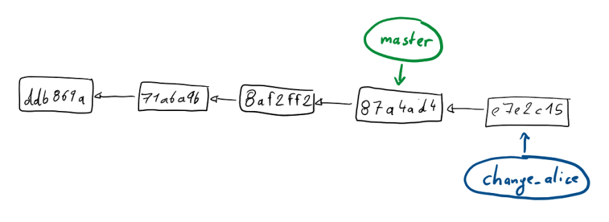
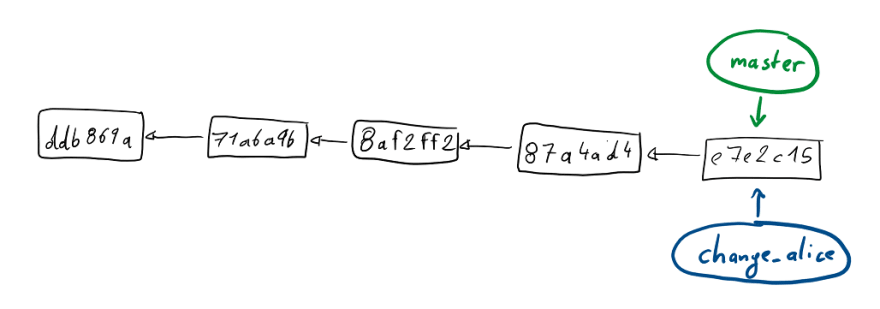
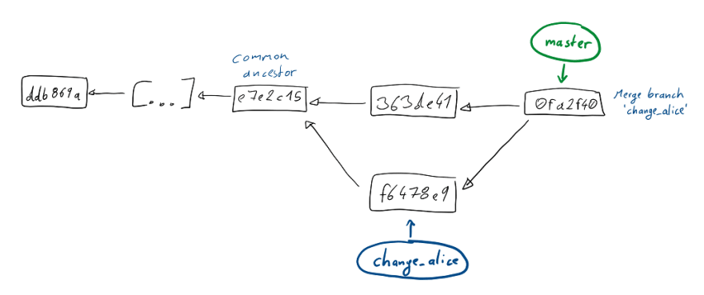

A reference to git commands and related theories:

## Initialise Git

#### To create a local repo and pushing to github repo:
```
echo "# shoppernet" >> README.md

git init

git add README.md

git commit -m "first commit"

git remote add origin [repo_url]

git config --global user.name <username>

git config --global user.email <email>

git config credential.helper 'cache --timeout=3600'

git push -u origin master
```

## Branches

#### To create a new branch:

```
git branch [branch_name]
```

#### To switch a branch:

```
git checkout [branch_name]
```

#### To push a branch:

```
git push -u origin [branch_name]
```

#### To pull from remote branch:

```
git checkout master

git pull [remote_name or remote_url] [branch_name]
```

`git pull` does a `git fetch` followed by a `git merge` to update the local repo with the remote repo

#### To merge git pull changes

If merging needs a merge commit which will be the case if it is not a fast forward merge then your editor opens up for a merge commit message

```
Type merge commit message
```

#### To delete a local branch from your machine

```
git branch -d {branchname} # gives error if local branch not merged

git branch -D {branchname} # force deletes the branch without checking merged status
```

#### To delete a remote branch from the server

```
git push origin --delete {remotebranch}
```

## Remote

#### To see the 'origin' remote repository url

```
git config --get remote.origin.url
git remote get-url origin // alternate method
```

#### To set the 'origin' remote repository url

```
git remote set-url origin <remote-rep-url>
```

## Commits

HEAD is the pointer to the current commit we're at in our Dev Environment.

### To view git commits

```
git log
```

#### To get the first commit

```
git rev-list HEAD | tail -n 1
```

#### To see a pretty format of commits log

```
git log --pretty=format:"%h - %an, %ar : %s"
```

#### To see a nit form of commits log

```
git --no-pager log --oneline
```

### Remove commits

#### To remove the last commit from git

```
git reset --hard HEAD^
```

#### To remove multiple commits from the top
```
git reset --hard HEAD~2
```
to remove the last two commits. You can increase the number to remove even more commits.

#### To "uncommit" the commits while keeping the changes around for reworking, remove the "--hard": 
```
git reset HEAD^
```
which will evict the commits from the branch and from the index, but leave the working tree around.

#### To save the commits on a new branch name before removing current branch commit(s)

```
git branch newbranchname
git reset ...
```

### Git Difference

Ways to see difference between commits:

```
git diff # Between HEAD and modified files in working directory

git diff --staged # Between HEAD and modified files in stage area

git diff <commit_hash> # Between HEAD and a specific commit

git diff <commit1_hash> <commit2_hash> # Between two commits

git diff <commit_hash>^! # Between a commit and its previous commit
```

## TAGS

#### To create a basic tag

```
git tag <tagname>
```

#### To create an annotated tag with a message

```
git tag -a <tagname> -m <tagmessage>
```

#### To delete local tag

```
git tag -d <tagName>
```

#### To delete remote tag '12345' (eg, GitHub version too)

```
git push origin :refs/tags/<tagName>
```

#### An alternative approach to delete remote tag

```
git push --delete origin <tagName>
```

## Merge

### Fast Forward merging

There are no other conflicting changes to any files, and nothing changed on master, this will go through without a hitch in what is called a fast forward merge.

```
git checkout master
git merge <branch_name_to_merge_with_master>
```


`Before Git Merge`

 
`After Git Merge`

### Divergent Branches merging

This is the case when both master and <branch-1> originated from the same commit, but since then they diverged, each having their own additional commit. Here a fast-forward merge is not possible. Instead git opens up an editor and allow you to type a message of the merge commit.

 
`Before Divergent Branches Git Merge`

 
`After Divergent Branches Git Merge`

Revisions in git, aren't only a snapshot of your files but also contain information on where they came from from. Each commit has one or more parent commits. Our new merge commit, has both the last commit from master and the commit we made on the other branch as it's parents.

### Resolving Conflicts

There are often times you face merge conflicts while merging branches. This generally due different changes to the same file(or files) in both branches. Git cannot resolve this for you, this needs to be done manually.

#### Make changes:

To see the list of file affected by merge conflict:

```
git status
> # On branch branch-b
> # You have unmerged paths.
> #   (fix conflicts and run "git commit")
> #
> # Unmerged paths:
> #   (use "git add ..." to mark resolution)
> #
> # both modified:      styleguide.md
> #
> no changes added to commit (use "git add" and/or "git commit -a")
```

To see the beginning of the merge conflict in your file, search the file for the conflict marker `<<<<<<<`. When you open the file in your text editor, you'll see the changes from the HEAD or base branch after the line `<<<<<<<` HEAD. Next, you'll see `=======`, which divides your changes from the changes in the other branch, followed by `>>>>>>>` BRANCH-NAME. In this example, one person wrote "open an issue" in the base or HEAD branch and another person wrote "ask your question in IRC" in the compare branch or branch-a.

```
If you have questions, please
<<<<<<< HEAD
open an issue
=======
ask your question in IRC.
>>>>>>> branch-a
```
#### Save changes

Decide if you want to keep only your branch's changes, keep only the other branch's changes, or make a brand new change, which may incorporate changes from both branches. Delete the conflict markers `<<<<<<<`, `=======`, `>>>>>>>` and make the changes you want in the final merge. In this example, both changes are incorporated into the final merge:

```
If you have questions, please open an issue or ask in our IRC channel if it's more urgent.
```

In case you want remove the conflicted file:

```
git rm styleguide.md
```

#### Commit the merge:

```
git add .
git commit -m "Resolved merge conflict."
```

#### To abort merge conflict (without commiting)

In case anything goes wrong during merge conflict

```
git commit --abort
```

### Using Mergetool

#### To set vimdiff as default merge tool:
```
git config merge.tool vimdiff
git config merge.conflictstyle diff3
git config mergetool.prompt false
```
Other tools are meld, opendiff, kdiff3, tkdiff, xxdiff, tortoisemerge, gvimdiff, diffuse, ecmerge, p4merge, araxis, emerge.

#### To run mergetool

```
git mergetool
```

In the Terminal:
```
  +----------------------+
  |       |      |       |
  |LOCAL  |BASE  |REMOTE |
  |       |      |       |
  +----------------------+
  |      MERGED          |
  |                      |
  +----------------------+
```
These 4 views are

**LOCAL** – this is file from the current branch

**BASE** – common ancestor, how file looked before both changes

**REMOTE** – file you are merging into your branch

**MERGED** – merge result, this is what gets saved in the repo

You can navigate among these views using `ctrl+w`. You can directly reach MERGED view using `ctrl+w` followed by `j`.

#### If you want to get changes from REMOTE

`:diffg RE`

#### If you want to get changes from BASE

`:diffg BA`  

#### If you want to get changes from LOCAL

`:diffg LO`

#### Save, Exit, Commit and Clean up
```
:wqa save and exit from vi
git commit -m "message"
git clean
```

## Rebase

Suppose you sent a PR and before it gets merged, other commits were merged with the `master` branch. If you do `git merge` with your PR branch then mater looks something like:


When PR is merged, where C8 and C9 are the commits merged into master while your PR was in review phase.

The workflow just works fine with an additional merge commit. You need to fix any merge conflicts if required and it's good to go. But there might be cases where having a single merge commit containing all the changes to all your files probably isn’t what you want to expose in the end.

### Rebasing on the base branch

Rebase is not a substitution of the merge. Hence rebase is not used to replace the merge, but it completes it.

```
git checkout my-feature
git rebase master
git checkout master
git merge my-feature --ff
```

`rebase` is used on the feature branch whereas `merge` is performed of the base branch.


`Before Rebase`


`After Rebase`

Rebase is an incredibly powerful tool when you're working on your own `development` branch which is based on a shared branch, e.g. the `master`.

Using rebase you can make sure that you frequently integrate the changes other people make and push to master, while keeping a clean linear history that allows you to do a fast-forward merge when it's time to get your work into the shared branch.

#### Resolving conflicts 

It stops the current `rebase` and asks you to fix the conflict. The conflicting files will be marked  as “both modified” and the conflicting sections will have some markup to help you find what differs. When you’re done with the modifications, you then `git add` the modified files and run

```
git rebase --continue
```

to let the rebase continue.

The conflict will be resolved in the commit that was just being applied.

#### To abort Rebasing

In case rebase went wrong:

```
git rebase --abort
```

#### To pull with rebase

```
git pull -r
```

You can also set `git pull` to use rebase by default:

```
git config --global pull.rebase true
```

### Rebasing your own work

Rebase can be used to add/change/remove your commits directly from your own branch too! The “base” on which you rebase can be virtually any commit — even a direct ancestor. 

Use "interactive mode" of rebase by adding `-i` or `-interactive` argument. By doing so, Git will open your editor of choice (the one defined in your `EDITOR` environment variable) and list all of the commits that will be affected by the rebase operation, and what should be done with every single one of them. 

From your editor, Git lets you reorder, rename, or remove commits, but you can also split single commits into multiples, merge two or more commits together, or change their commit messages at the same time! Pretty much everything you’d like to do with your history is possible with `rebase`.


Before rebasing:
```
$ git --no-pager log --oneline
57f15b4 (HEAD -> master) add D and E files
61681da add B file
7d4a28d add C file
f92bb1d add A
78b3f67 root commit
```

You want following changes tot the last 4 commits:

* The first commit message is wrong: it should be “add A file”, not “add A”
* File B and C were added in the wrong order
* File D should have been added at the same time as file C, not with file E
* Finally, file E should be added in its own separate commit

Start with `git rebase -i HEAD~4`. This tells Git to interactively rebase the last 4 commits from HEAD inclusive. `HEAD~4` points to the “root commit” which is the commit upon which we will rebase.

Editor shows:

```
pick f92bb1d add A
pick 7d4a28d add C file
pick 61681da add B file
pick 57f15b4 add D and E files

# Rebase 78b3f67..57f15b4 onto 78b3f67 (4 commands)
#
# Commands:
# p, pick = use commit
# r, reword = use commit, but edit the commit message
# e, edit = use commit, but stop for amending
# s, squash = use commit, but meld into previous commit
# f, fixup = like "squash", but discard this commit's log message
# x, exec = run command (the rest of the line) using shell
# d, drop = remove commit
#
# These lines can be re-ordered; they are executed from top to bottom.
#
# If you remove a line here THAT COMMIT WILL BE LOST.
#
# However, if you remove everything, the rebase will be aborted.
#
# Note that empty commits are commented out
```

Modifications:
```
reword f92bb1d add A
pick 61681da add B file
pick 7d4a28d add C file
edit 57f15b4 add D and E files
```

Instructions to Git:

* Stop at the first commit to let us change the commit message
* Reorder the second and third commit to have them in the correct order
* Stop at the last commit to let us do some manual amending

Upon saving the file and quitting your editor, you’ll be presented with your editor again, and the first commit message will be in front of you. The rebase is happening and you are being prompted to change the first commit message. Let’s change it from “add A” to “add A file”, then save and quit.

The reordering of the second and third commits is done transparently by Git. This leaves us with the last amend we asked to perform. Here, we’re stopped after the “add D and E files” commit. As we wanted to create a single commit with C and D files and a new one only for E, we need to perform the following steps as if we were amending additional commits on the top of our branch:

```
git reset HEAD~1
git add D
git commit --amend -m ‘add C and D files’
git add E
git commit -m ‘add E file’
git rebase --continue
```

After rebasing:
```
$ git --no-pager log --oneline
2d6361f (HEAD -> master) add E file
1e33d62 add C and D files
180b4bd add B file
eb6beee add A file
78b3f67 root commit
```

## Stash

#### To stash changes

If at any point you have local changes that you do not yet want to put into a commit, or want to store somewhere while you try some different angle to solve a problem, you can stash those changes away.

A git stash is basically a stack of changes on which you store any changes to the Working Directory.

#### To bring back stashed changes by removing changes from the stash

```
git stash pop
```

#### To bring back stashed changes without removing changes from the stash

```
git stash apply
```

#### To inspect stash

```
git stash list
```

#### To show changes in the lastest entry on stash

```
git stash show
```

#### To create a new branch from the lastest entry on stash

```
git stash branch <branch-name>
```
